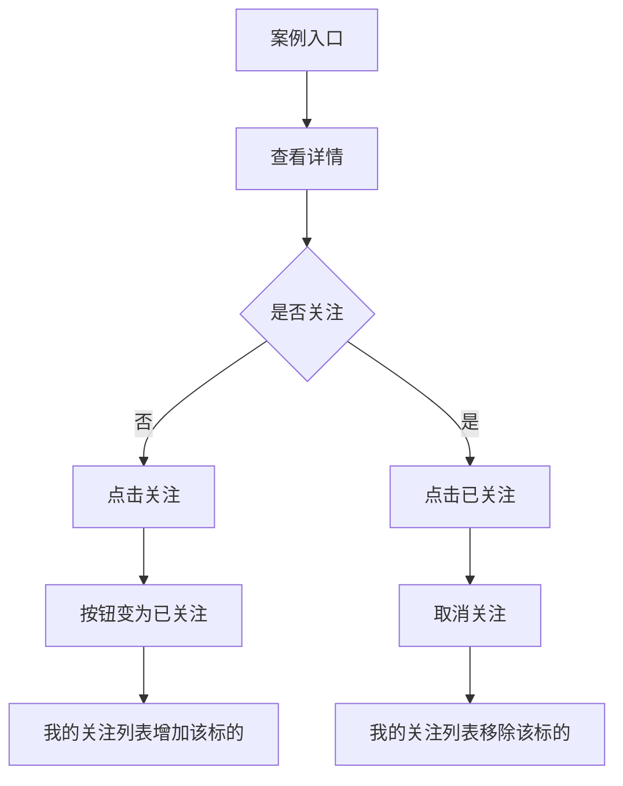

# 关注列表交互方案

[打开交互原型](./index.html)

## 设计目标

用户从案例入口找到感兴趣的标的，在详情页关注；之后能在“我的关注”集中查看，并随时取消关注。入口状态、详情按钮与关注列表需要保持一致。

## 任务流程

交互原型用“发现案例”模拟入口，便于独立演示；真实产品中的入口和详情是两个页面。

## 状态与反馈

| 场景 | 按钮 | 列表 | 反馈 |
| --- | --- | --- | --- |
| 未关注 | 关注 | 不出现在“我的关注” | 点击后原位变为“已关注” |
| 已关注 | 已关注 | 出现在“我的关注” | 再次点击直接取关并移出列表 |
| 关注列表为空 | — | 显示空状态与返回发现的方向 | 不显示无意义的空卡片 |
| 切换“全部 / 我的关注” | 保留对应状态 | 只变更筛选结果 | 数量实时同步 |

取关是可逆的轻量操作，本练习直接生效并用短暂提示确认；若真实业务把关注用于推送、持仓提醒等高影响动作，应重新评估是否需要二次确认。

## 三类状态标签

| 标签 | 表达什么 | 示例色彩 |
| --- | --- | --- |
| 新增案例 | 新内容刚进入案例库 | 柔和绿色 |
| 案例跟踪 | 仍在持续更新 | 柔和靛蓝 |
| 清仓 | 案例已结束 | 中性灰 |

标签描述的是**案例进程**，关注按钮描述的是**用户个人状态**。两者同时出现时，在视觉和文案上分开，避免把“清仓”误认为“取消关注”。

## 实际项目需要再确认

- “我的关注”是否只收录标的，还是同时收录案例？
- 清仓后的内容能否继续关注、是否继续出现在列表？
- 关注数量和状态由哪个服务同步？离线、失败时如何回滚？
- 入口页是否需要单独的“已关注”筛选，还是只在个人页汇总？

原型用内存保存状态，刷新后会重置；它用于讨论交互，不连接真实账户或数据服务。
